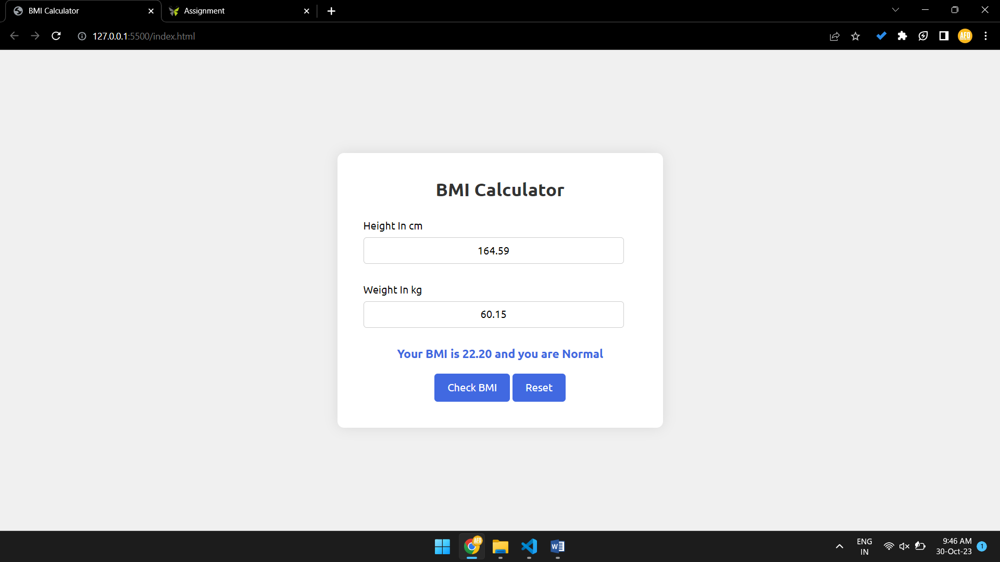

**BMI Calculator**

This is a simple BMI (Body Mass Index) calculator web application created using HTML, CSS, and JavaScript. BMI is a measurement of a person's body fat based on their weight and height. This application allows users to input their weight in kilograms and height in centimeters and calculates their BMI. Based on the calculated BMI, it provides information about whether the user is underweight, normal weight, overweight, or obese.

**Features:**
- **Input Fields:** Users can input their weight in kilograms and height in centimeters.
- **Calculation:** When users click the "Check BMI" button, the application calculates the BMI and provides a corresponding message about the user's weight status.
- **Reset:** Users can reset the input fields and result message by clicking the "Reset" button.
- **Responsive Design:** The application is designed to be responsive and can be used on various devices and screen sizes.

**How to Use:**
1. Enter your weight in kilograms and height in centimeters.
2. Click the "Check BMI" button to see your BMI and weight status.
3. To calculate again, click the "Reset" button.

**BMI Categories:**
- **Underweight:** BMI less than 18.5
- **Normal Weight:** BMI between 18.5 and 24.9
- **Overweight:** BMI between 25 and 29.9
- **Obese:** BMI 30 or higher

**Instructions for Developers:**
- Clone or download the repository from GitHub.
- Open the `index.html` file in your web browser to use the BMI calculator.
- You can customize the styles by modifying the `style.css`.
- The BMI calculation logic is implemented in the `script.js` file. You can modify it according to your requirements.
